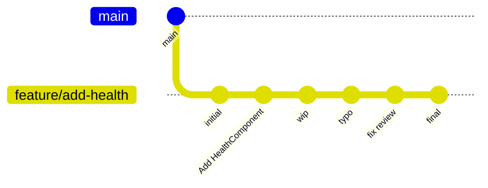
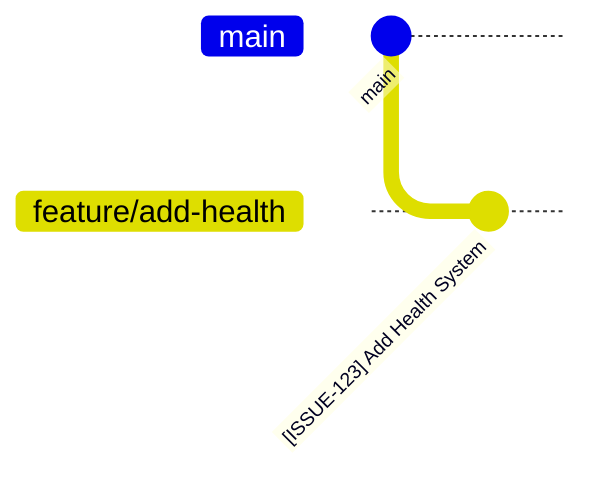
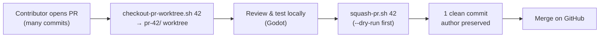

# Guide for Creating a Pull Request

Pull requests is the main and only process in which we contribute to our main branch

## TOC
<!-- mtoc-start -->

* [Part 1: Creating the PR](#part-1-creating-the-pr)
* [Part 2: Updating the PR After Review](#part-2-updating-the-pr-after-review)
* [Part 3: Squashing a PR Into One Clean Commit](#part-3-squashing-a-pr-into-one-clean-commit)

<!-- mtoc-end -->

## Part 1: Creating the PR

1. Open <https://github.com/Indie-Seishun/indie-seishun>
2. Click the **"Compare & pull request"** button that appears at the top
3. Make sure:
   * **Base:** `main`
   * **Compare:** `robomario` (or your branch)
4. Add a title like: `Add Health System (HealthComponent, HurtState, HealState, HealthBarDisplay)`
5. Add a brief description of what the changes do
6. Click **"Create pull request"**

**IMPORTANT** The PR title should contain the following message and format

[YOUR-ISSUE-123] - Your issue summary

---

## Part 2: Updating the PR After Review

If someone leaves comments and asks you to make changes:

```bash
# 1. Make your changes in the code

# 2. Stage and commit:
git add .
git commit -m "Address review feedback: fix X, Y, Z"

# 3. Push to your branch:
git push origin robomario
```

The PR will automatically update with your new commit.

---

## Part 3: Squashing a PR Into One Clean Commit

When a PR accumulates many small commits ("wip", "typo", "fix review", ...) it muddies `main`'s history. This workflow collapses all of a PR's commits into a single clean commit **while preserving the original contributor's authorship**, then force-pushes the result. It is a reviewer/maintainer action.

### When to squash

- ✅ A PR has messy/incremental commits and you want one clean commit on `main`
- ✅ You are reviewing a PR (including one from a fork) and want to tidy it before merging
- ❌ The commits are already clean and individually meaningful
- ❌ You don't have write/maintainer access (this force-pushes to the PR branch)

> **Script vs GitHub's "Squash and merge" button?** The button is simplest for ordinary same-repo PRs. Use this script when you want to clean up the commits _before_ the merge, preserve a specific author, or locally review/test the PR in its own worktree first.

### What squashing does

Before — 6 messy commits:



After — 1 clean commit (author preserved):



<details><summary>ASCII fallback (non-GitHub viewers)</summary>

```
BEFORE (6 messy commits)              AFTER (1 clean commit)

* fix review                          * [ISSUE-123] Add Health System
* typo                                * ─── main ───
* wip
* Add HealthComponent
* initial
* ─── main ───
```

</details>

### The workflow



### Step by step

```bash
# 1. Pull the PR into an isolated worktree (handles forks automatically)
./scripts/dev-tools/checkout-pr-worktree.sh 42
#    → creates indie-seishun/pr-42/, fetches the PR ref, inits submodules

# 2. (Optional) review/test the PR locally without leaving your branch
cd ../pr-42        # open in Godot, run the game, inspect changes

# 3. Preview the squash — no changes made
./scripts/dev-tools/squash-pr.sh 42 --dry-run

# 4. Squash into one clean commit + force-push (prompts to confirm)
./scripts/dev-tools/squash-pr.sh 42
#    custom message:
./scripts/dev-tools/squash-pr.sh 42 -m "[ISSUE-123] Add Health System with HUD"

# 5. Merge the PR on GitHub — it's now a single clean commit

# Cleanup the worktree when done:
./scripts/dev-tools/checkout-pr-worktree.sh --remove 42
```

### Notes

- The squashed commit message **defaults to the PR title** — so name your PR well (e.g. `[ISSUE-123] - summary`), or pass `-m "..."` to override.
- The **original contributor's authorship is preserved** automatically.
- Step 4 **force-pushes** to the PR branch — only run this as a maintainer/reviewer.
- Every PR gets its **own dedicated `pr-<n>` worktree** — checkout and squash locate it by name only (`pr-<n>`, or the legacy `pr-#<n>`), so `--remove` and `--remove --all` only ever touch `pr-*` worktrees, never a real dev-branch worktree like `tsunderick` or `robomario`.
- Requires: workspace set up ([setup-workspace.sh](2-multi-branch-workspace-setup.md)), `gh` CLI authenticated, and `jq`.
