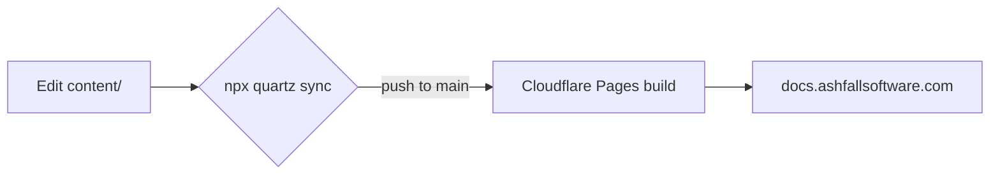

Anyone on the team can publish here. The whole workflow is: edit Markdown in `content/`, preview locally, push. That's it.

## The two-minute workflow

1. **Clone & install** (one time):

   ```bash
   git clone https://github.com/Ashfall-Software/docs.ashfallsoftware.com.git
   cd docs.ashfallsoftware.com
   npm ci
   ```

2. **Write or edit** a Markdown file in `content/` — folders become sections automatically.

3. **Preview** with hot reload at `http://localhost:8080`:

   ```bash
   npx quartz build --serve
   ```

4. **Commit and push** — the site rebuilds and deploys on its own:

   ```bash
   npx quartz sync
   ```

## Markdown superpowers

This site supports Obsidian Flavored Markdown, which gives you a few upgrades over plain Markdown:

> [!example] Callouts
> Use callouts like `> [!warning]`, `> [!tip]`, `> [!info]` to make important notes stand out. This one is an `[!example]`.

**Wikilinks** — link pages by file name, no paths or extensions needed: `[[contributing]]` renders as [[contributing]]. If the target moves, the link still resolves.

**Checkboxes** — interactive task lists:

- [x] Set up Quartz
- [ ] Write a guide worth reading

**Diagrams** — Mermaid code blocks render as diagrams:



**Math** — LaTeX via `$...$` and `$$...$$`, if you're into that sort of thing.

## Page metadata (frontmatter)

Optional YAML at the top of each file controls titles and more:

```yaml
---
title: My Page Title
---
```

Useful options: `title`, `description`, `tags`, `draft: true` (hides the page from the site), and `aliases` (alternative names people might search for).

> [!warning] Drafts still live in git
> `draft: true` keeps a page off the published site, but the file is still in the repository — which is private anyway. Don't put secrets in here regardless.
